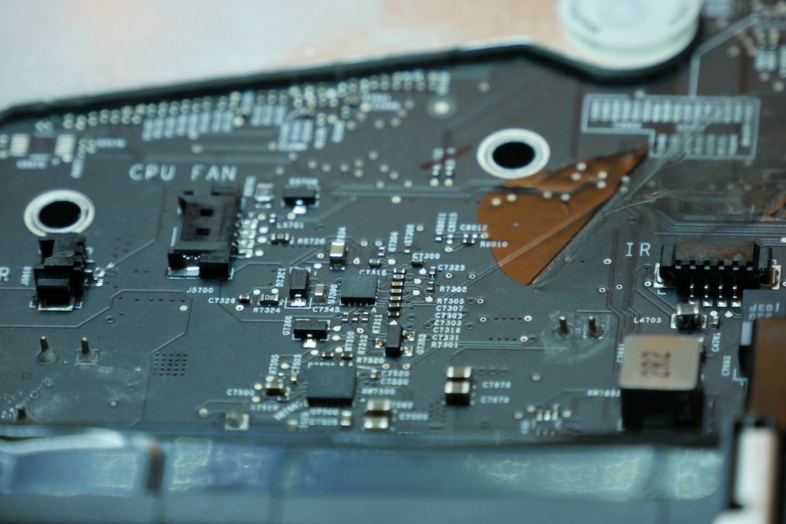
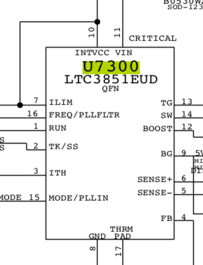

L’iMac de Sophie a déjà rendu de loyaux services, mais elle en a besoin encore aujourd'hui.

## Préambule

**Modèle:** iMac 21.5" 2009  
**Numéro de modèle:** A1311  
**Numéro de carte mère:** 820-2494  
**Symptômes:** Ne s'allume plus. Aucune surtension, aucun évènement particulier. S'est allumé aléatoirement pendant un certain temps.  
**Solution:** Remplacer U7300 (Linear Technologies LTC3851EUD)

## L'histoire: "L'iMac de Sophie"

L’iMac de Sophie a déjà rendu de loyaux services, mais elle en a besoin encore aujourd'hui. En tant que graphiste nomade, qui grandit (vieillit ?) et recherche donc enfin un bureau fixe, elle va en profiter pour reprendre une activité sédentaire, avec des outils eux aussi sédentaires (l’iMac donc, pour ceux qui suivent pas…).

Le Macbook Pro 2010 de Sophie, qui a bien voyagé, mérite un peu de repos. Et c’est donc cet iMac qui vient prendre la suite.

Mais cet iMac, depuis quelque temps déjà, ne s’allume plus.

Il ne s’allume plus du tout, aucun signe de vie. Un bel iMac écran 21.5 pouces, millésime fin-2009, qu’on appelle aussi A1311. Ces iMacs ont parfois un problème commun et connu. Une publication de forum parlant des même symptômes, du moins en apparence ([https://boards.rossmanngroup.com/forum/board-repair-troubleshooting/28544-solved-imac-820-2494-a-this-board-don-t-turn-on](https://boards.rossmanngroup.com/forum/board-repair-troubleshooting/28544-solved-imac-820-2494-a-this-board-don-t-turn-on)) est disponible. En réparation, l’information, c’est le nerf de la guerre. Il faut donc, dans un premier temps, vérifier cette intuition, et ces symptômes :

- L’alimentation fonctionne très bien, la diode de diagnostic de l’iMac(1) affiche bien une connexion à l’alimentation
- L’appui sur le bouton Power ne donne rien. Alors que la seconde diode de diagnostic devrait s’allumer (et l’ordinateur avec lui).

## Démontage et diagnostic: un iMac, ça prends de la place !

Première étape, le démontage de l’appareil. Les guides ifixit sont vos amis : Ils sont claire, pas à pas et très bien fait. Petit conseil : Si des commentaires sont présents à une étape, lisez-les, vous éviterez peut-être une galère. Les iMac de 2009 sont encore assez simple : l’écran est simplement fortement aimanté à la coque. Une paire de ventouse permet d’en venir à bout. Comme pour les iPhones, il ne faut surtout pas enlever complètement l’écran au risque d’arracher les connecteurs. On soulève seulement assez pour glisser sa main et atteindre les premières nappes de connections.

Le diagnostic de la carte mère d’un iMac est toujours un peu plus complexe. Si on a besoin d’alimenter la carte pour faire des mesures de tensions, il faut pouvoir la sortir, tout en la gardant connectée à l’alimentation.

On a donc procédé en retirant également l’alim, et en la remettant dans une petite boite plastique, scotchée à la va-vite. L’idée est d’éviter de se prendre, par inadvertance, un coup de jus venant du 220V de la carte, mais également, d’éviter de court-circuiter la carte, si par exemple, on laisse tomber un outil dessus (ou une goutte bière, on est jamais à l’abri d’un accident).

Avec la carte extraite, on peut donc faire toutes les mesures nécessaires, et surtout les comparer à celles qui ont été postées dans ce sujet de forum qui parlait d’un problème similaire.

Petite astuce : pour faire ce genre de recherche, il est plus souvent utile de chercher en anglais, pour élargir votre horizon de recherche, et de cherche à partir du numéro de la carte mère (dans ce cas 820-2494).

Toutes les lignes d’alim ont les bonnes tensions, en particulier celles nommées en S5, qui sont celles de l’état éteint (mais branché…) de l’appareil. On fonce donc directement vers les mesures PP1V1\_S5\_REG, PP3V3\_S5\_REG, PP5V\_S5\_LDO et PP12V\_S5 qui sont toutes bonnes… U7300 semble être notre source de problème. Il faut lui trouver un remplaçant, sur ebay, ou auprès d’un distributeur électronique et le remplacer.

## Un LTC3851? Ca se trouve partout!

Ce composant est un LTC3851, un PMIC (Power Management Integrated Circuit). Son rôle est de générer différentes tensions stabilisées en fonction des différents capteurs auxquels il est connecté. Il génère le 5 Volt qui permet de booter et maintenir allumé une bonne partie des composants de la machine.

La puce fautive est au centre, avec un marquage U7300 juste à sa gauche.

U7300 est en boitier QFN (Quad Flat No-leads). On le soude et le dessoude donc à l’air chaud. Dans notre cas, il est était sacrément bien accroché, et on est monté à 450°C pendant quasiment une minute, pour l’extraire (un peu en morceaux). Une belle galère donc.

Les cartes d’iMac résistent bien à la chaleur, et cela nous le prouve encore, aucun problème ici. On nettoie ensuite l’étain encore présent sur les pads, pour en remettre un peu de nouveau (avec de plomb, cette fois-ci, bien plus simple à gérer en terme de température).

En général, pour souder un QFN, on met toujours trop d’étain, et une fois posé, ca dépasse de tous les cotés et il y a des courts-circuits de part et d’autre. Il suffit ensuite de repasser au fer à souder (la panne en couteau aide bien, une « KN » sur notre station Hakko FM-203) pour enlever l’excès et replacer l’étain sur les pads du QFN et de la carte.

Extrait du schéma électrique, montrant U7300 et le type de composant: un LTC3851

Il nous reste le classique nettoyage du flux de soudure, remontage, et redémarrage… et là, magie, notre iMac s’allume, instantanément, comme au premier jour !

Si vous voulez en savoir plus sur cette réparation, si vous avez des questions ou si vous avez besoin de nos services, contactez-nous !

A bientôt pour de nouvelles aventures.
