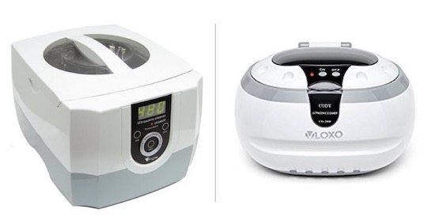
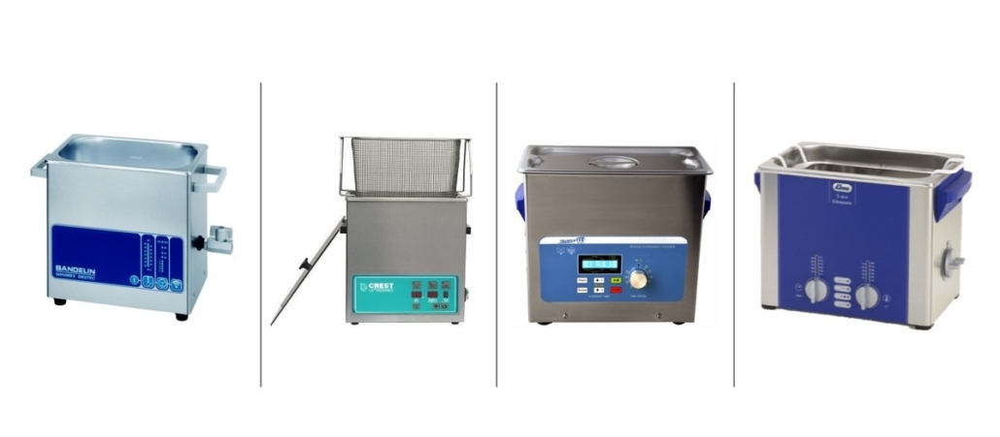

 On va démarrer avec un petit coup de gueule : toutes ces boutiques qui vous vendent des désoxydations sans résultat garanti à 20 ou 30€, demandez leur la marque de leur bac ultrason : S’ils réfléchissent, ou ne savent pas, c’est mauvais signe. Si en plus ils n’ont pas enlevé les protection EMI (ces petits « caches » métalliques sur votre carte mère) autant dire qu’ils vous vendent du vent ! Ils vous vendent une désoxydation dans de l’eau distillée avec un bac ultrason LIDL à 30€, et là, ne rien faire reviendrait exactement au même résultat.

Il y a quelques règles que trop peu de professionnels respectent :

- Une désoxydation, on ne la facture que si elle donne des résultats.
- Elle se fait dans un bac ultrason pro : Elmasonic, Crest, EMAG…
- On enlève tous les caches, toutes les protection EMI, tous les plastiques, sinon, ça ne sert à rien.
- On rince à l’alcool IPA 95% minimum, et on sèche le tout d’abord à l’air, puis au four (ou à l’air chaud, et séchage long).

Voilà ! Tout ceux qui ne suivent pas ce mode opératoire vendent une prestation inutile. Passons maintenant aux quelques explications sur les ultrason, le nettoyage du même nom, et le bac ultrason à utiliser.

Bac à Ultrason bas de gamme. Ils sont inefficaces sur une carte mère de MacBook Pro ou de MaBook Air.  
Nous n'utiliserons jamais ce type de bac.

## Qu’est-ce qu’un bac ultrason :

Les ultrasons sont un principe de nettoyages (et de dégazage des liquides) utilisés depuis très longtemps dans l’industrie ou le commerce. Il est venu plus récemment dans les boutiques de réparation électronique, avec la miniaturisation et l’arrivée de composants montés en surface (SMD). Un bac ultrason est un bac rempli d’une solution de nettoyage (une solution aqueuse, dans la plupart des cas, avec ajout de savon divers et parfois d’alcool). Le bac produit des vibrations dans une certaine gamme de fréquence (là encore variable selon l’application).  
Ces vibrations vont permettre de décoller tous les éléments mal accrochés entre-eux (en général, des choses qui n’ont rien à faire là, comme des saletés, ou autres oxydes). La variation de fréquence des ultrasons permet de déloger les saletés dans différents recoins, et de différentes tailles.

## Dans quel cadre est-il utilisé (ailleurs) :

Les ultrasons sont utilisés par les professionnels, industriels ou les amateurs avertis pour nettoyer :

- Pièces mécaniques : pièces de vélo, pièces de moteur, etc…
- Pièces d’horlogerie, impossible à nettoyer à la main
- Lunettes (oui, votre opticien nettoie vos branches de lunettes aux ultrasons)
- Production et réparation électronique : pour désoxyder, retirer les traces de flux de soudure, de solvant ou d’autres nettoyant ou produits chimiques utilisés pendant la production
- Chimie : pour dégazer un liquide (retirer les bulles)
- Etc….

## Dans quel cadre est-il utilisé (chez nous)

On utilise les ultrasons avec une solution spéciale de nettoyage électronique et PCB. Cela permet d’enlever les traces de flux de soudure restantes (après nettoyage à l’alcool IPA), d’enlever les traces d’oxydation suite à une exposition de la carte à des liquides. Il se peut également que des composants dont les soudures ont été oxydées se décollent. Cela permet de les identifier et de les changer de façon préventive.

## La différence entre le bon bac ultrason, et le mauvais bac ultrason

La question du bon bac ultrason est extrêmement importante dans la communauté de réparateurs de carte mère de Macbook. C’est un sujet récurrent de question, de demandes et de tests divers.  
Les marques n’étant pas toutes accessibles partout dans le monde, certains choix doivent être faits selon le continent ou vous habitez.

Les caractéristiques de base d’un bon bac ultrason sont d’abord sa fréquence. En électronique, il doit idéalement vibrer entre 35 kHz et 45 kHz.  
Il lui faut également une taille minimum pour immerger la totalité de la carte : 3.0 L sont suffisant pour des Macbook Air ou Macbook Pro 13’, mais il faut un bac de 6.0 L (30x15x15cm environ) pour les Macbook pro 15’. Il lui faut absolument (oui, absolument !) une fonction « sweep », qui sert à faire varier la fréquence de vibrations autour de la référence. Cela sert à déloger les petites impuretés. Sans cela, un bac ultrason est très peu utile.

Il lui faut une puissance minimum (sinon, il ne sert à rien de plus que dégazer votre solution de nettoyage…). Et enfin, il faut qu’il puisse chauffer, et ça aussi c’est indispensable (même si on peut contourner le problème en faisant chauffer le liquide de nettoyage par ailleurs).En général, le petit bac ultrason type nettoyage de bijou, vendu 30€ en grande surface, ne chauffe pas, n’a pas de fonction sweep, n’est pas assez puissant et est trop petit.

Exemples de bacs à ultrason de laboratoire.  
Liste des fabricants, de gauche à droite: [Bandelin](https://bandelin.com/produkte/?lang=fr), [Crest](https://www.crest-ultrasonics.com/), [SharperTek](https://www.sharpertek.com/) et [Elma](https://www.elma-ultrasonic.com/fr/) (celui qui équipe notre atelier).

### Les bacs pour réparateurs de carte mère

Nous utilisons dans notre atelier un bac [Elmasonic S30H](https://www.laboandco.com/nettoyage-ultrasons-bac-ultrasons-elmasonic-s30h-ELM-1001955) fabriqué (en Allemagne) par la société Elma. Il est encore un peu petit et l’achat prochain d’un bac plus grand est prévu. C’est un bac utilisé plutôt en laboratoire (pas adapté pour une utilisation intensive en production, par exemple). Il vibre à 37 kHz, chauffe, à une fonction « sweep », et fait le bien le job qu’on lui demande. Notre prochain achat sera peut-être un bac SharperTek.  
Il semble que cette marque fabrique également de bon modèle, plus grand et moins cher que les Elma.

Mais bien d’autres marques existent:

Un consensus se dégage sur la marque Crest. Ce sont des bac ultrasons fabriquées aux USA, et semblent être les meilleures pour le nettoyage électronique. Cela vient de la fréquence utilisée (40 kHz) et de leur capacité à chauffer le liquide de nettoyage. A cela s'ajoute la capacité à effectuer un balayage de fréquence (la fonction appelée « Sweep ») autour de la fréquence principale. Ils sont très utilisés par les réparateurs basés aux USA. Mais ils sont malheureusement difficile à trouver en Europe. Elma (celui que nous possédons), Emag, SharperTek sont également des noms qui reviennent dans la communauté de réparateurs.  
Vous remarquerez que ce sont tous des fabricants qui fournissent également l’industrie (avec d’autres modèles) et que leurs bac sont réputés.
