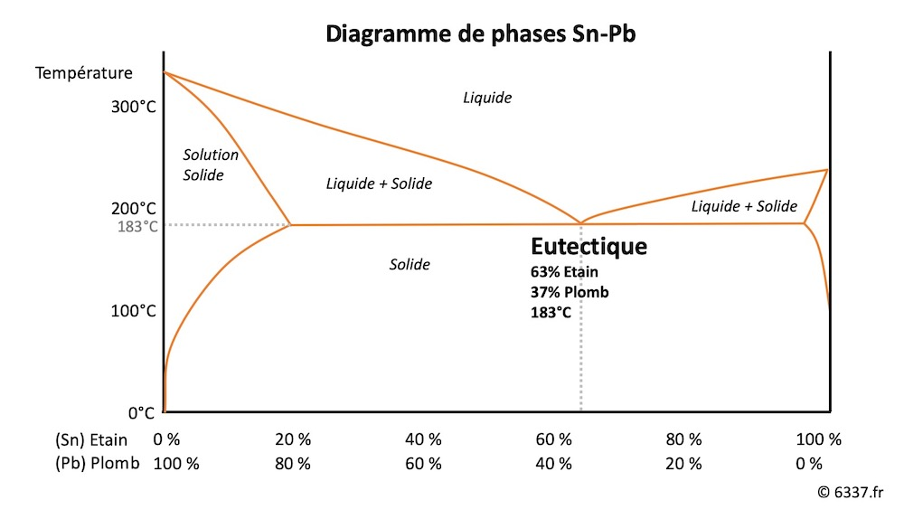

On s'est posé beaucoup de questions pour notre nom, pour trouver quelque chose qui nous représente vraiment. Certes, le plus simple est de décrire l'activité : Mac'Répar Lyon, par exemple. Beaucoup de réparateurs font ce choix (qui a le gros avantage d'aider au référencement...).

Mais on ne se sentait pas à l'aise avec cette idée. Chez 6337, on est plus des techniciens que des vendeurs, et on voulait que ça se reflète dans notre nom. Du coup, pas de "réparation", "clinique", ou "électronique" pour nous. Aussi, on ne voulait pas que notre concept s'arrête à la réparation de Mac. C'est le début, et le bout par lequel on attaque la réparation électronique. Notre rêve (inavouable) serait de pouvoir tour réparer, et surtout ce qui ne se répare pas déjà : "Réparer l'irréparable" ? C'est exactement notre ambition (mais c'est un peu trop long pour un nom).

6337, ça nous a plu tout de suite. Pour la symbolique, pour le clin d'oeil technique !

## 63 + 37 = 100

Vous ne l'avez peut-être pas remarqué, mais tout le sens du nom se cache derrière cette addition. 63 + 37 = 100. 63 et 37 sont deux pourcentages : les pourcentages d'étain (Sn) et de plomb (Pb) utilisés dans la majorité des soudures de réparation. Aujourd'hui, dans l'industrie, on n'utilise plus de plomb bien sûr (la norme RoHS est passée par là). Mais en atelier, on n'a pas le choix.

Alors pourquoi ce mélange exact de Sn63Pb37 ? C'est tout simplement le point eutectique de l'alliage étain-plomb. "Le point quoi ?!?". Oui, je l'ai entendu, vous l'avez pensé très fort. Le point eutectique est un point de fusion bien spécifique d'un alliage. C'est le point ou cet alliage passe du liquide, au solide (ou l'inverse) à la température la plus basse. Ce point est défini par une température, ici 183°C, une composition d'alliage précise, le fameux mélange d'étain à 63% et plomb à 37%. Toute autre composition aura une température de fusion supérieur aux 183°C de ce mélange spécifique.

Et 183°C, c'est très bien comme température : c'est une température que n'atteindra jamais un composant électronique. Mais c'est aussi une température qui ne détruira pas ce composant. Idéal pour souder sans tout casser donc.

La petite illustration ci-dessous montre un diagramme eutectique. Elle demande une rapide explication pour bien la lire. Il s'agit mélange Sn/Pb (étain-plomb, donc).

En abscisse (l'axe horizontal), se trouve le taux de chaque composé: étain (Sn) et Plomb (Pb). En ordonné (l'axe vertical) se trouvent les températures. Et entre les deux, on note les états (solide ou liquide), de l'alliage. Cela permet de connaître, pour chaque mélange, sa température de fusion et sa composition de liquide ou de solide. 183°C et 63/37, c'est ce point précis, idéal pour cet alliage. Tout simple, non ?

Voilà. Vous savez tout sur notre nom, et se qui se cache derrière. C'est un nom technique, précis, et qui définit la situation et la solution de soudure idéale. On se retrouve pas mal dans tout ça !
