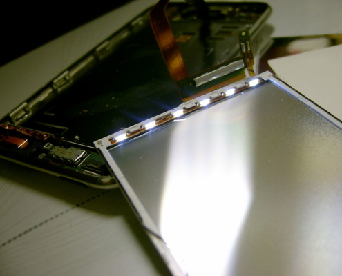
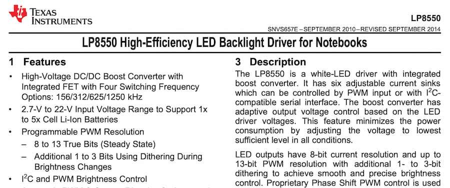

### Préambule :

Cet article porte sur des explications simples de fonctionnement d'un rétro-éclairage sur un écran. S'en suivent des détails bien plus techniques, pour utilisateurs avertis. Si votre objectif est uniquement de comprendre ce que votre réparateur préféré baragouine, arrêtez vous au premier chapitre (avant la migraine). Si vous êtes du genre technique et motivé, allez jusqu'au bout, et n'hésitez pas a poser des questions à la fin ! Ca nous aidera à améliorer l'article.

# Commençons par le commencement. C’est quoi le rétro-éclairage ?

Votre écran d’ordinateur n’est pas fait d’une seule couche, qui vous affiche des informations, mais de deux : Une couche qui affiche effectivement les informations, icônes et images. C’est ce qu’on appelle communément la dalle LCD. Une autre couche qui sert à éclairer l’écran, le rétro-éclairage ou _backlight_, dans la langue de Shakespeare.

## Principe de base du rétro-éclairage d'un écran

Le principe est simple, la première couche ne produit pas de lumière, elle ne fait qu’afficher ou masquer des points de couleur variable, et partiellement transparents (les fameux pixels) qui correspondent à l’information à afficher. Derrière se trouve un diffuseur, et des bandes de LED. Les bandes de LED sont en général disposées sur le côté de l’écran, et créent une faisceau de lumière à l’intérieur du diffuseur. Le diffuseur est une fine couche de matière plastique transparente, faite pour diffuser la lumière sur toute la surface de l’écran.

Le résultat est que la lumière crée par les LED, assez concentrée au départ, est diffusée de façon uniforme sur tout l’écran, puis passe au travers de la dalle LCD ou se trouve les pixels, pour afficher clairement une information qui sinon serait à peine perceptible. Les pixels de votre écran sont donc éclairés par l’arrière, par ce second système, pour que vous puissiez les distinguer : Eclairé par l’arrière = rétro-éclairage = Backlight.

Bande de LED du rétro-éclairage d'un iPod. (Wikipedia)

Le rétro-éclairage est un classique des pannes de MacBook Pro, et de nombreux autres ordinateurs portables. Si le circuit en charge de l’alimentation des LED est défaillant, votre ordinateur et votre affichage fonctionnera, mais vous distinguerez à peine les informations.

## Et sur un Mac, le _backlight_ marche comment ?

Sur le Mac d’avant 2016, le logo pomme sur le dos de l’écran est transparent lui aussi. Il n'est éclairé quand l’écran s’allume. Cette pomme blanche est en fait éclairé par le même système de rétro-éclairage. Par conséquent, quand votre rétro-éclairage est défaillant, vous devriez pouvoir distinguer votre écran en mettant une lampe de poche (ou le flash de votre portable) derrière l’écran, pile au niveau du logo Pomme…

C’est encore le moyen le plus simple de diagnostiquer une rétro-éclairage défaillant, et c’est celui que nous utilisons !

# Alimenter les LED du rétro-éclairage, c'est tout un programme

Place maintenant à un peu de technique. Une LED doit être alimenté pour briller. Logique. Elle est alimentée en tension, et on retrouve souvent des tensions de quelques volts à ses bornes : 2 à 5 Volts en général, pour chaque LED.

Nous venons de voir que le rétro-éclairage fonctionnait à partir d’une série de LED (une bande, parfois deux, une de chaque côté, sur les plus grands écrans d'ordinateur, voir une matrice de LED sur les écran de télévision) qui était ensuite diffusée au travers d’une feuille qui fonctionnait comme un prisme.

Chacune de ces LED étant montée en série, si nous en avons 10 sur la bande de LED qui éclaire notre écran, il nous faudrait entre 20 et 50V pour les alimenter (10 x 2 à 5 Volts = 20 à 50 Volts). Or, comme vous le savez, la tension de la batterie de votre ordinateur ne dépasse pas 12V.

Pour arriver à cette tension élevée, on utilise un circuit électronique, appelé _DC-DC Boost_. _DC-DC_ car il converti du courant continu (_Direct Current_ en anglais, le _DC_ de _AC/DC_...) vers du courant continu, et _Boost_, parce qu’il permet d’augmenter la tension de sortie, de la booster. Et il n’y a rien de magique là-dedans, on ne crée pas d'énergie de nulle part. Pour citer Lavoisier : "rien ne se perd, rien ne se crée, tout se transforme". C’est le cas ici. Une tension faible peut se convertir en tension plus forte, mais le courant de sortie sera réduit. La puissance d’entrée sera équivalente à la puissance de sortie, moins les pertes de conversion. La puissance étant égale à la tension multipliée par le courant, si on augmente la tension en réduisant le courant, on booste la tension, avec la même puissance (les puristes excuserons les raccourcis honteux de cette dernière phrase).

## Créer 50V depuis une batterie 12V

Les allergiques à la technique sont excusés à partir d'ici !

On alimente une inductance, (une bobine de fil). Pour faire simple, le rôle de cette bobine est de stocker des électrons dans ses enroulements de fil quand on la débranche de la sortie, électrons qui vont ensuite être renvoyés vers cette même sortie quand on va la reconnecter. A cette sortie, il y a nos LED, vous l’aurez compris. Le fait de _débrancher_ puis _rebrancher_, permet justement de faire monter cette tension de sortie.

On alimente donc une bobine avec 12V. En sortie de celle-ci, on place un transistor MOSFET qui servira d’interrupteur commandé. Lorsque cet interrupteur est ouvert, les électrons sont stockés dans la bobine, et quand on le ferme, ces électrons s’échappent vers la sortie (les LED, dans notre cas). La tension d’entrée stable à 12V, devient une tension sous forme de pics à 60V en sortie. Il nous suffit de filtrer ces pics avec des condensateurs (qui stockent les électrons pour lisser la sortie). On obtient une tension de sortie plus élevée que l’entrée.

\[caption id="attachment\_615" align="aligncenter" width="900"\] Extrait de la datasheet du LP8550, le driver LED qui équipe le backlight de MacBook Pro 2010 à 2012.\[/caption\]

Dans les faits, la fréquence de commutation du transistor permet de faire varier la hauteur de nos pics de tension (Une ouverture plus longue donne un pic plus haut, jusqu’à une certaine limite) et donc de faire varier la tension de sortie lissée.

En d’autres termes, quand vous augmenter la luminosité de votre écran avec la touche , vous réduisez la fréquence de commutation (temps entre ouverture et fermeture) du transistor du _DC-DC Boost_. C’est l’inverse pour réduire la luminosité : le temps ouverture-fermeture est plus court -> donc les électrons stockés sont moins nombreux ->le pic de tensions à la fermeture est plus petit -> la tension d’alimentation des LED est plus faible -> votre écran brille moins…

## Driver LED, inductance, MOSFET, fusible...ça en fait du monde

Toute cette gymnastique est créée et géré par une seule puce, appelée _Driver LED_. La bobine est extérieure à cette puce, elle est bien trop grosse. Par contre, le MOSFET est parfois intégré au D_river LED,_ sur les MacBook Pro/Air avant le Retina, et extérieur au _Driver LED_ sur les MacBook Pro/Air plus récents.

Des capteurs de courants sont également présents (sous la forme de résistance de _shunt_). S’ils sont défaillants, ils donnent une mauvaise information au driver LED. Vu les hautes-tensions en jeu, il y a également un fusible en aval, qui vient protéger le tout.

Ce petit listing doit commencer à vous donner des pistes de pannes possibles (ou vous laisser dubitatif) :

- Si les résistances en jeu dans la mesure de courant son défaillantes, le _Driver LED_ ne saura pas réguler la sortie correctement. Et votre _backlight_ ne fonctionnera pas.
- Si le fusible à grillé, à cause d’un dommage liquide par exemple, c’est tout le rétro-éclairage qui n’est plus alimenté.
- Si le MOSFET est constamment ouvert, ou fermé, c'est pareil, plus rien ne fonctionne.
- Enfin, si on ne dit pas au Driver LED de s'allumer, il n'éclaire pas l'écran... une simple piste coupée ou un condensateur en court-circuit peuvent en être responsables !

# Analyse du backlight d'un MacBook Pro fin 2013

Les composants de gestion du rétro-éclairage des MacBook Pro et MacBook Air sont tous situés à côté du Driver LED. Soit du même côté de la carte-mère, soit de l’autre côté pour la bobine. Ils ne sont pas forcément proches du connecteur de l'écran.

On distingue bien sur le schéma en illustration, le _Driver LED_ nommé _U7700_. Un _LP8548_ fabriqué par _International Rectifier_, et totalement indisponible chez les distributeurs officiels: Apple est passé par là. Autour, sont placés tous les composants dont on a parlé plus haut:

- La résistance/capteur de courant _R7700_
- le fusible _F7700_ (32V-3A)
- un MOSFET pour alimenter ou couper le backlight - noté _Q7700_
- l'Inductance _L7710_
- Le MOSFET du _DC-DC Boost_ _Q7701_
- Une diode qui fait également partie de notre _DC-DC Boost_  - notée _D7710_

Les choses se passent comme suit:

1. 12V arrivent de la batterie ou du chargeur (ligne d'alimentation globale de l'ordinateur PPBUS\_G3H) et passe d'abord par le fusible.
2. Ensuite le capteur de courant R7700 donne l'information de la puissance consommée au Driver LED U7700
3. Q7700 est uniquement là pour couper le rétro-éclairage: Si l'ordinateur se met en veille par exemple.
4. Tout ce courant passe ensuite par le montage composé de l'inductance, le MOSFET et la Diode. C'est le DC-DC Boost. Le tout est piloté par le Driver LED (qui régule le tout en fonction des informations du capteur de courant)
5. La tension de sortie est ensuite filtré par une série de condensateur, qu'on ne voit pas sur ce schéma
6. Le tout va directement au connecteur de l'écran (qu'on ne voit pas non plus dans l'image).

C'est finalement, pas si compliqué. Depuis le MacBook Pro 2009, jusqu’au plus récents MacBook Pro Touchbar, le circuit de backlight n’a subit que de légères retouches et modifications. Si vous avez compris ce qui se trame ici, vous pourriez être capable de diagnostiquer le rétro-éclairage de n'importe quel MacBook Pro ou MacBook Air.

Le Driver LED a évolué avec la machine et sa gestion d’énergie. Quelques composants ont été replacés plus proche, d’autres plus loin, mais globalement, l'idée est la même.

# Conclusion

Si vous êtes arrivé jusqu'ici, que vous avez tout compris, et que vous voulez tester ça en vrai, n'hésitez pas à nous envoyer un CV !!!

Si vous n'avez pas tout compris, c'est parce que nous ne pouvons (trop) en mettre dans un seul article. On envisage de peut-être faire quelque chose de plus détaillé, et en 2 parties, pour l'avenir. Mais si vous comprenez le principe, vous en savez déjà beaucoup sur les Mac, les écrans, et le fonctionnement de leur rétroéclairage.

N'oubliez que notre boulot c'est de réparer ces machines. Alors si cet article vous à convaincu de nous confier votre Mac, c'est par ici:

\[av\_button\_big label='Faire réparer mon rétroéclairage !' description\_pos='below' link='page,644' link\_target='' icon\_select='no' icon='ue800' font='entypo-fontello' custom\_font='#ffffff' color='theme-color' custom\_bg='#444444' color\_hover='theme-color' custom\_bg\_hover='#444444' av\_uid='av-aizzf' custom\_class='' admin\_preview\_bg=''\] On a tout donné pour vous convaincre là... \[/av\_button\_big\]

\[/av\_textblock\]
