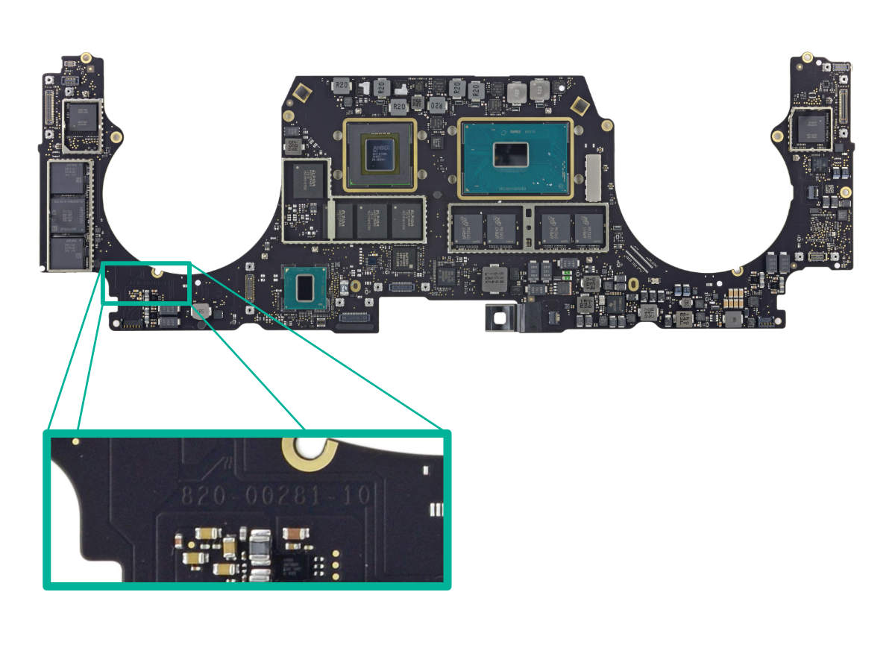

## Un numéro ? sur ma carte mère ?

Ce n'est ni un numéro de série, ni un numéro de pièce. Pourtant, ce numéro d'identification est essentiel en réparation. Le numéro de carte mère est un numéro qui identifie un "modèle" de carte mère.

Je mets "modèle" entre guillemets car une carte avec plus de RAM ou un CPU plus puissant aura malgré tout le même numéro. En général, on va trouver un numéro par modèle de Mac. Mais pas toujours. Apple rends l'identification de ces Mac bien compliqués.

## A quoi ça ressemble :

Un numéro de carte démarre par 820- et est suivi d'autres chiffres et parfois d'une lettre, genre 820-XXXX. Ils sont utilisés pour toutes les cartes électroniques et PCB d'Apple. Cela inclus les carte mère d'iPhone, mais aussi les cartes filles: Carte comportant la prise Magsafe, carte fille dite "I/O Board", etc...

Ce "820" est toujours présent. Il est suivi le plus souvent de 4 chiffres (exemple: 820-4924 pour un MacBook Pro 13 Retina 2015), mais comporte maintenant parfois 5 chiffres (comme 820-00840 pour le MacBook Pro 13 TouchBar). Il peut aussi y avoir une lettre à la fin de ce numéro de carte.

Ce numéro est inscrit sur la carte, en des endroits différents selon le modèle et la génération. Ce serait trop facile autrement. Il est noté de façon assez petite, et ton sur ton... en utilisant le gris-mauve de la carte de façon légèrement plus claire.

Autant le dire, si l'on n'est pas un initié, il n'est pas simple à trouver. Pourtant il est essentiel.

\[caption id="attachment\_795" align="aligncenter" width="1200"\] Exemple de numéro de carte mère de MacBook Pro\[/caption\]

## Un numéro essentiel

Alors, à quoi il sert ce numéro de carte ? Et bien:

- Il permet d'identifier un modèle de carte mère, et donc de savoir rapidement si deux cartes sont identiques.
- Il permet donc de chercher des carte mères identiques, pour un remplacement (essayez de taper 820-4924 dans Google, pour voir).
- Il permet de trouver les schémas des carte mères.

Ce numéro, est malgré tout différent du "numéro de pièce", qui lui, sera différent pour chaque version de carte: RAM, CPU ou SSD soudé différent. Celui-ci commence en général par 661, suivi de 4 chiffres. Les détails sont disponibles sur une autre page (voir le sommaire).

Tableaux de correspondance

Parce qu'on est sympa (mais surtout parce qu'on s'en sert nous aussi). On vous à préparé des tableaux de correspondance entre numéro de carte mère, modèle de Mac, Model ID : Bientôt dispo pour vous (et nous).
