Pour toute question sur ce qu'est le numéro d'une carte mère, et à quoi il correspond. Référez-vous à l'article idoine: [A quoi correspond le numéro de carte mère](https://www.6337.fr/a-quoi-correspond-le-numero-de-carte-mere/)

# Ben oui, où ?

Ca dépend. Comme pour tout ce qui concerne les choix techniques d'Apple... Bon. Dans tous les cas, le numéro de votre carte mère est gravé dessus. Comme expliqué dans l'article qui explique à quoi il correspond. Il est gravé en gris-mauve clair sur gris-mauve foncé, sur le PCB de votre carte mère, en petit.

Mais le problème, c'est qu'il n'est jamais au même endroit. Il est parfois facile à trouver, et d'autres fois moins. L'objectif de cet article est donc de vous donner quelques indices sur où chercher (ben oui, où?), et sur quoi cherchez (on va vous mettre de petits exemples. Et comme on fait ça bien, On va lister ça par modèle de Mac. Parce que si on à une carte mère en main, on à de grande chances d'avoir une idée du modèle. Allez, c'est parti !

# MacBook Pro Unibody

## MBP Unibody 13"

Ces Mac plus anciens ont des carte mères qui épousent la forme du ventilateur. Les modèles de 2010 à 2012 ont gardé le même form-factor, et les carte mères ont très peu changés de forme.

Le numéro de carte se trouve le plus souvent en bas à gauche de la carte (Mac retourné et ouvert, batterie face devant vous). C'est la zone entouré en vert sur l'image. Et pour exemple, le 820-2530-A qui correspond à un MacBook Pro mi-2010. Attention, sur certains modèles, le numéro de carte mère se trouve en dessous d'un des connecteurs de cette zone...

\[caption id="attachment\_806" align="aligncenter" width="601"\]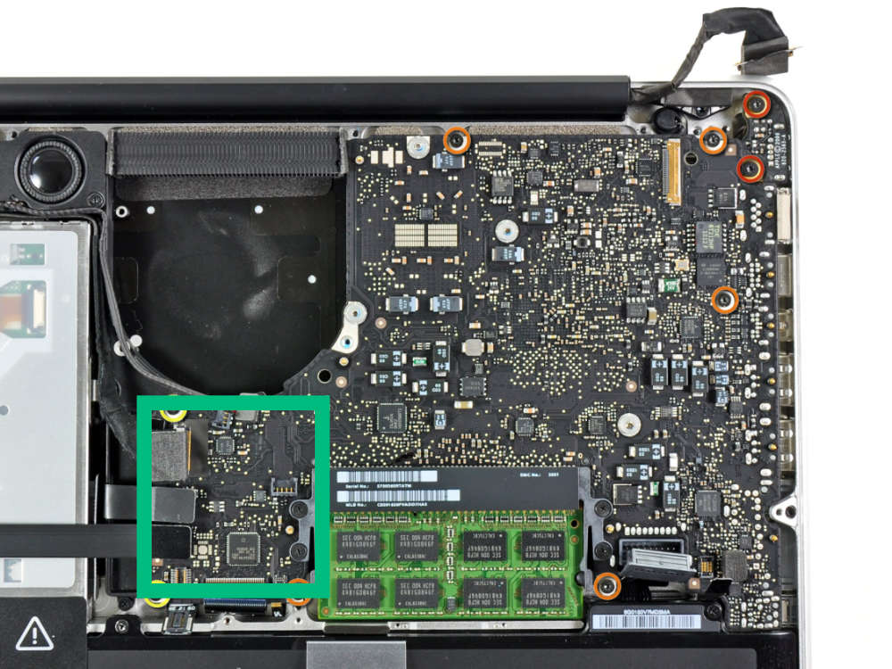 Le numéro de carte mère se trouve dans cette zone.\[/caption\]

\[caption id="attachment\_807" align="aligncenter" width="331"\]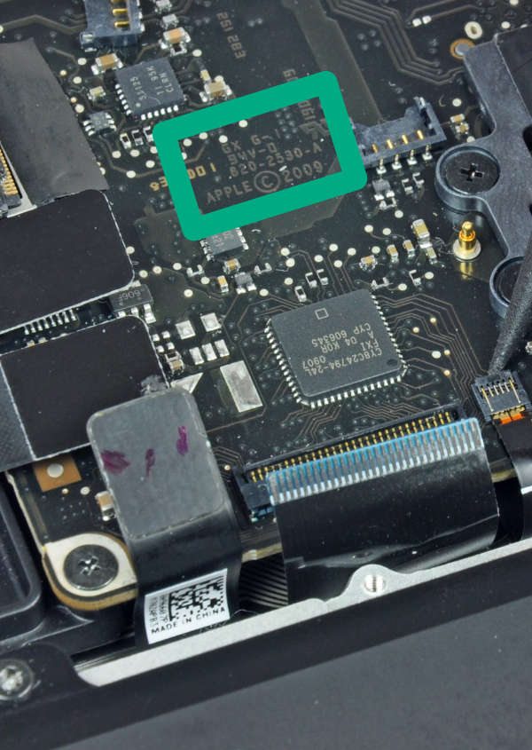 Exemple d'un 820-2530-A, gravé entre le module RAM et le connecteur du disque dur.\[/caption\]

## MBP Unibody 15

Sur les modèles 15 pouces, la carte mère à la même forme que sur les modèles 13 pouces. un rectangle qui épouse la forme des ventilateurs. Par contre, ceux-ci ont 2 ventilateurs, et forcément, le numéro de carte mère ne se trouve pas au même endroit que pour les 13 pouces.

Prenez votre Mac face à vous, sur dos, capot inférieur ouvert et batterie devant vous. Le numéro de carte se trouve en dessous ou à gauche du ventilateur gauche. Voyez notre illustration d'un MacBook Pro 15 Unibody 2012 pour plus de détails.

\[caption id="attachment\_814" align="aligncenter" width="655"\]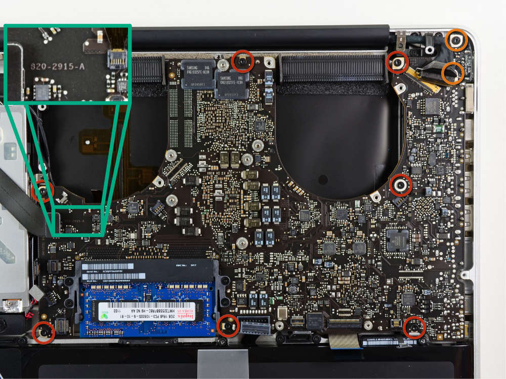 Le numéro de carte zoomé dans le cadre vert clair.\[/caption\]

# MacBook Pro Retina

## MBPr 13"

Le MacBook Pro Retina ont une forme de carte mère bien différente des Unibody. Les numéros de carte mère sont également en des endroits différents.

### MBPr 13" 2012 et 2013

Le numéro de carte est en haut à droite de la carte mère. On vous mets des photos dès qu'on les récupère, promis!

Photos à venir...

### MBPr 13" 2014 à 2015

Pour ces Mac, le numéro de carte mère se trouve en bas à gauche de celle-ci, toujours, Mac retourné, capot retiré et batterie face à vous. Il est parfois écrit de façon très discrète. Ouvrez les yeux.

\[caption id="attachment\_819" align="aligncenter" width="652"\]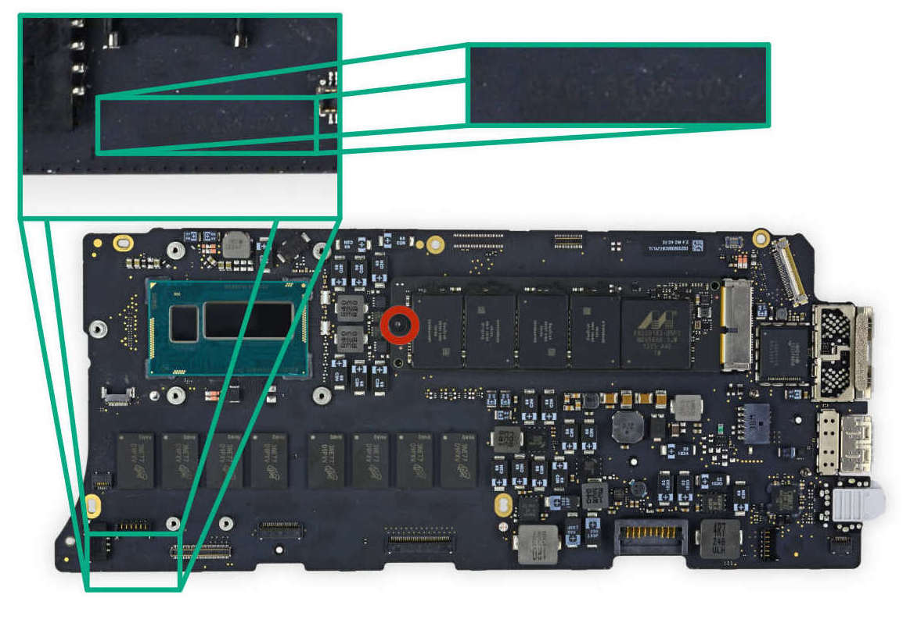 On vous avait prévenu. C'est parfois très discret...\[/caption\]

## MBPr 15"

### MBPr 15" 2012 à 2015

On a de la chance. Le numéro de carte est au même endroit pour tous les MacBook Pro Retina 15 pouces. Et c'est relativement facile à trouver. Toujours en bas à gauche de la carte mère, au niveau du coin, sous le SSD, comme sur la photo ci-dessous.

\[caption id="attachment\_822" align="aligncenter" width="645"\]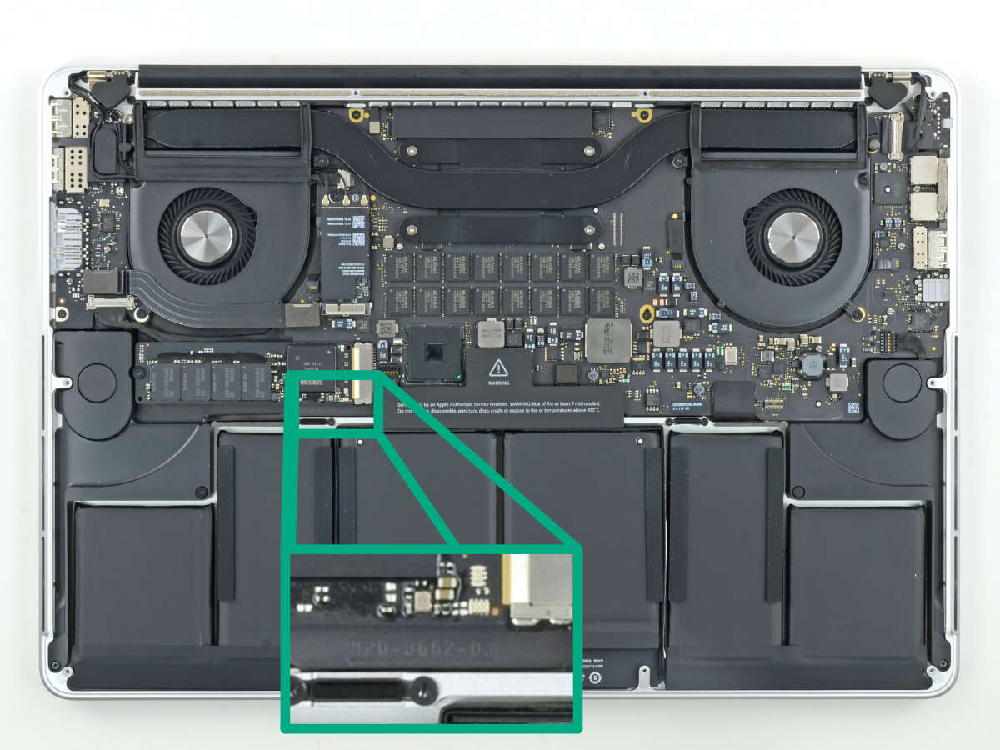 Batterie devant vous. en bas à gauche de la carte mère.\[/caption\]

# MacBook Pro TouchBar

Alors, pour les TouchBar ça va être compliqué. Il y a beaucoup de différences entre les version 2016, et 2017, et entre les version avec le TouchBar et celles sans le TouchBar. Oui, nous les avons appelé Touchbar malgré tout, pour la simplicité et la compréhension (ils sont de la même génération).

## MBP TB 13"

### MBP TB 13" 2016 no TouchBar

**Celui avec des touches de fonction (donc sans TouchBar...)**

On commence avec le MacBook Pro 2016, celui avec des touches de fonction classiques (le TouchBar sans TouchBar quoi...). C'est aussi le modèle avec un SSD amovible, vous savez ?

En bien, justement, le numéro de la carte mère est juste au dessus de ce SSD. Il est recouvert par un autocollant.

\[caption id="attachment\_824" align="aligncenter" width="576"\]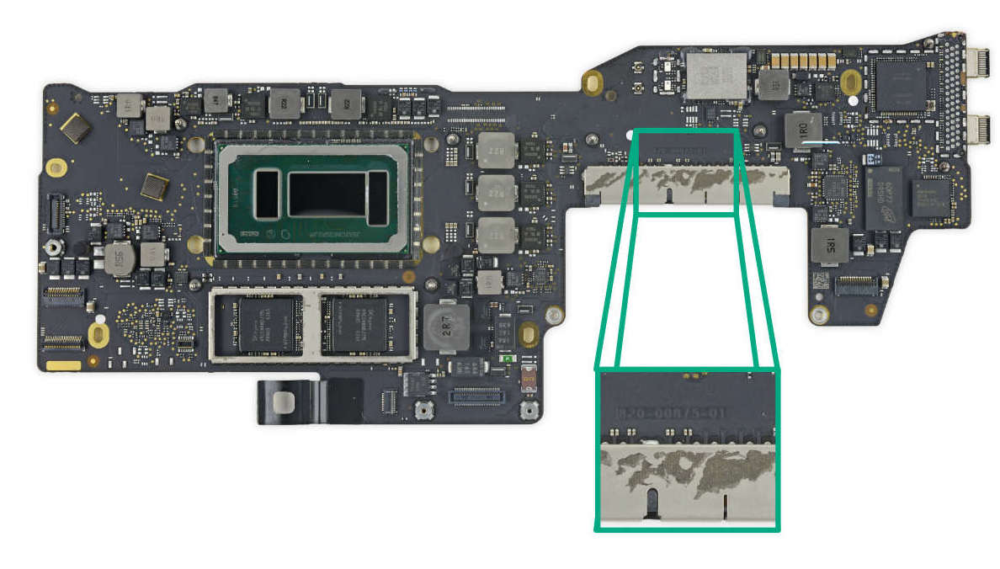 Sous l'autocollant qui relie SSD et carte mère, on trouve notre numéro de carte.\[/caption\]

### MBP TB 13" 2016 à 2019 TouchBar

**Ceux avec TouchBar... (oui, je sais, mais ça se comprend non?)**

Les TouchBar ont la fameuse carte mère en forme de moustache, qui épouse la forme des deux ventilateurs. Ici, le numéro de carte mère se trouve n'est pas visible quand on ouvre le Mac (ce serait trop simple voyons...). Apple à fait le choix judicieux de placer ce numéro derrière la carte. Il faudra donc, en plus d'ouvrir le Mac, démonte la totalité de la carte mère pour la retourner. Une fois que tout ceci est fait. Le numéro de carte mère est sous la moustache de gauche, carte face à vous, et moustaches qui remontent... bref, voyez la photo :

\[caption id="attachment\_827" align="aligncenter" width="596"\]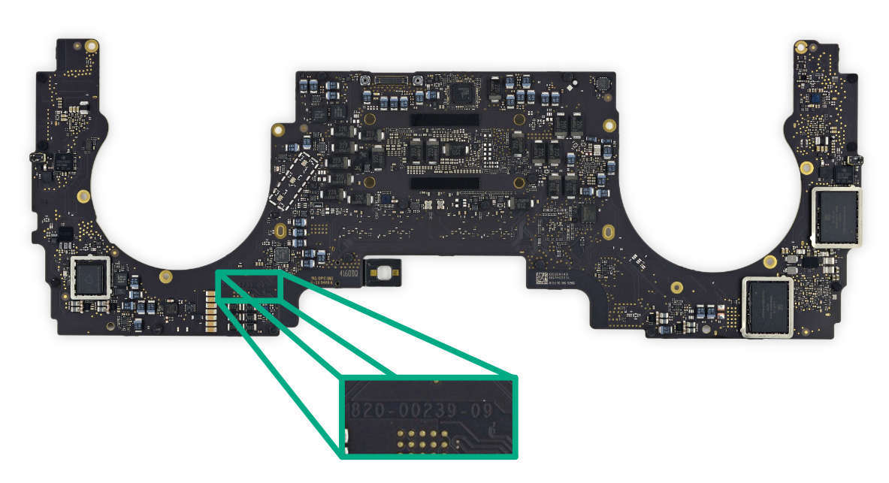 Il ne s'agit pas de la face mais du dos de la carte mère. Il faut la retirer pour accéder au numéro.\[/caption\]

## Modèle 15 pouces:

### MBP TB 15" 2016 à 2018 TouchBar

Sur les modèles 15 pouces, jusqu'en 2018. Le numéro de carte se trouve sur l'avant de la carte, mais quasiment au même endroit que pour les modèles 13 pouces. Avant de la carte, moustache de gauche, et juste en dessous, le numéro de votre carte mère.

### MBP TB 15" 2019 TouchBar

Ici, le numéro de carte mère est sur la face avant, mais coté droit de la carte mère.

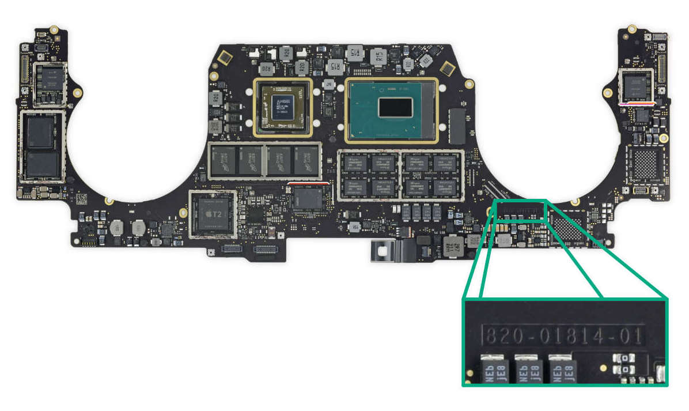

 

# MacBook Air

## Modèle 11 pouces:

### MBA 11" 2010 - 2012:

Ici, le numéro de carte mère se trouve sous la carte Wifi/Bluetooth. Il faut d'abord débrancher les antennes, dévisser puis retirer cette carte.

On vous mets une illustration dès qu'on la trouve... (désolé).

### MBA 11" 2013 - 2015:

Sur les MacBook Air 11" de 2013à 2015, Apple à placé le numéro de carte mère le long du bord haut de la carte, au dessus du CPU. Il est bien plus facile à trouver.

\[caption id="attachment\_842" align="aligncenter" width="575"\]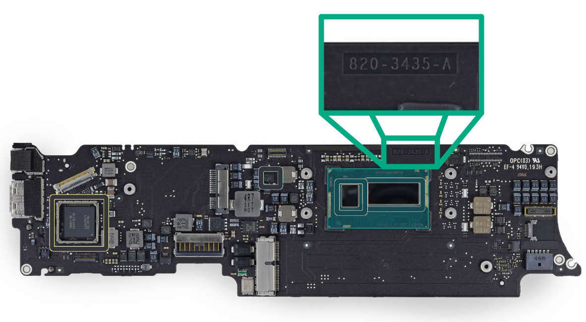 Sur les MacBook Air Récents, le numéro de carte se trouve au dessus du CPU.\[/caption\]

 

## Modèle 13 pouces:

### MBA 13" 2010 - 2011:

A gauche, sous le SSD, ou au centre de la carte... en gros.

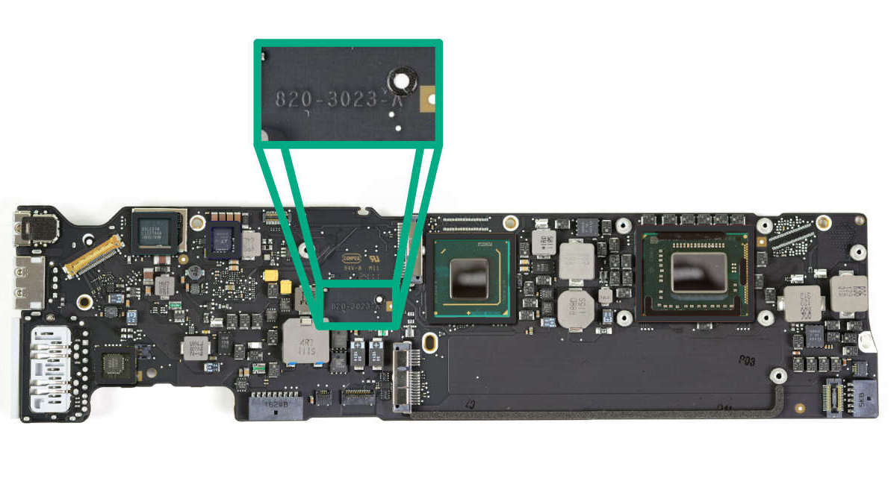

### MBA 13" 2012:

A gauche de la carte, juste au dessus du haut-parleur.

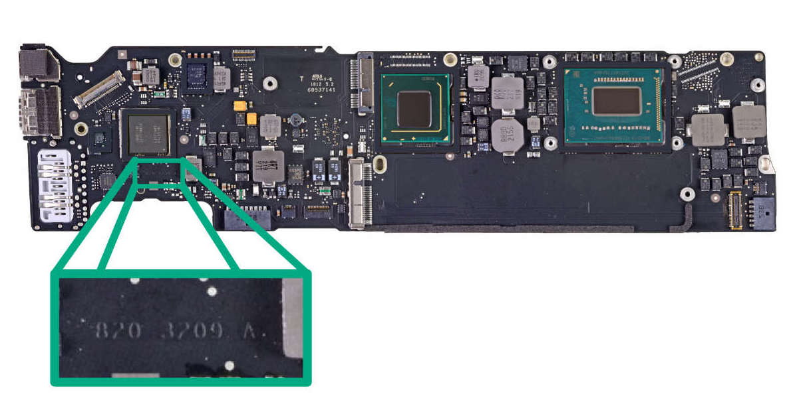

### MBA 13" 2013 - 2017:

Le numéro de carte mère se trouve sous le SSD.

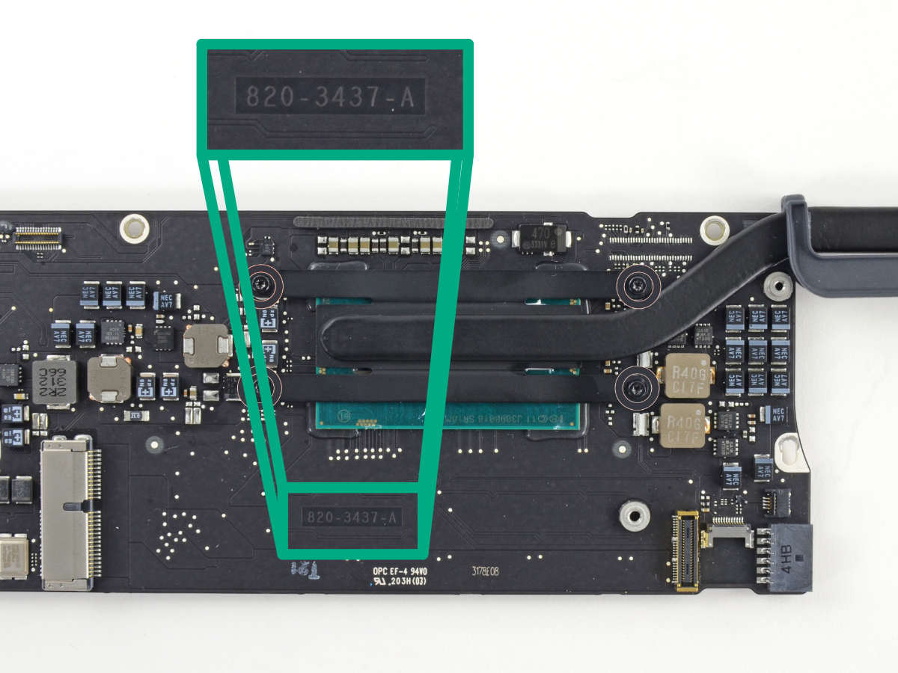

### MBA 13" Retina 2018 - 2019:

On remarque que la carte mère change totalement de forme et de conception par rapport aux modèles de 2010 à 2015. Comme pour le MacBook, Apple conçoit des carte mères qui ressemblent bien plus à des carte logiques que l'on retrouve dans les iPad: Plus compact, tout soudé.

Et le numéro de carte mère est ici gravé en contact Or, comme sur les iPhone, et plus en gris ton sur ton.

Il se trouve tout à droite de cette carte très compact.

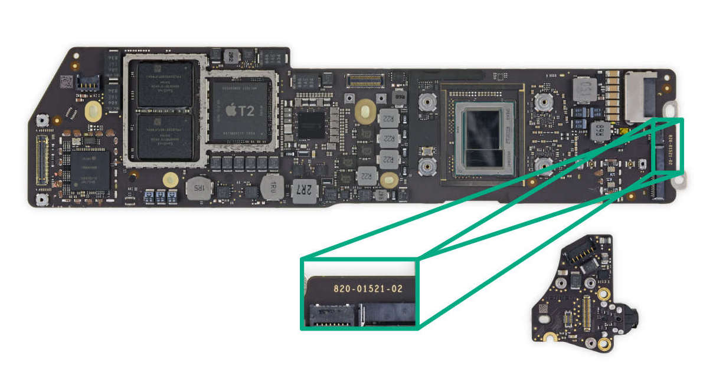

# Conclusion:

Petit rappel, en guise de conclusion:

- Cet article est voué à évoluer (On y ajoutera bientôt les MacBook 12")
- Signalez nous toute erreur, tout oubli de notre part
- Les correspondances entre numéro de carte mère, numéro Axxxx, EMC et année du Mac font l'objet d'un autre article avec des jolis tableaux bien lisibles
