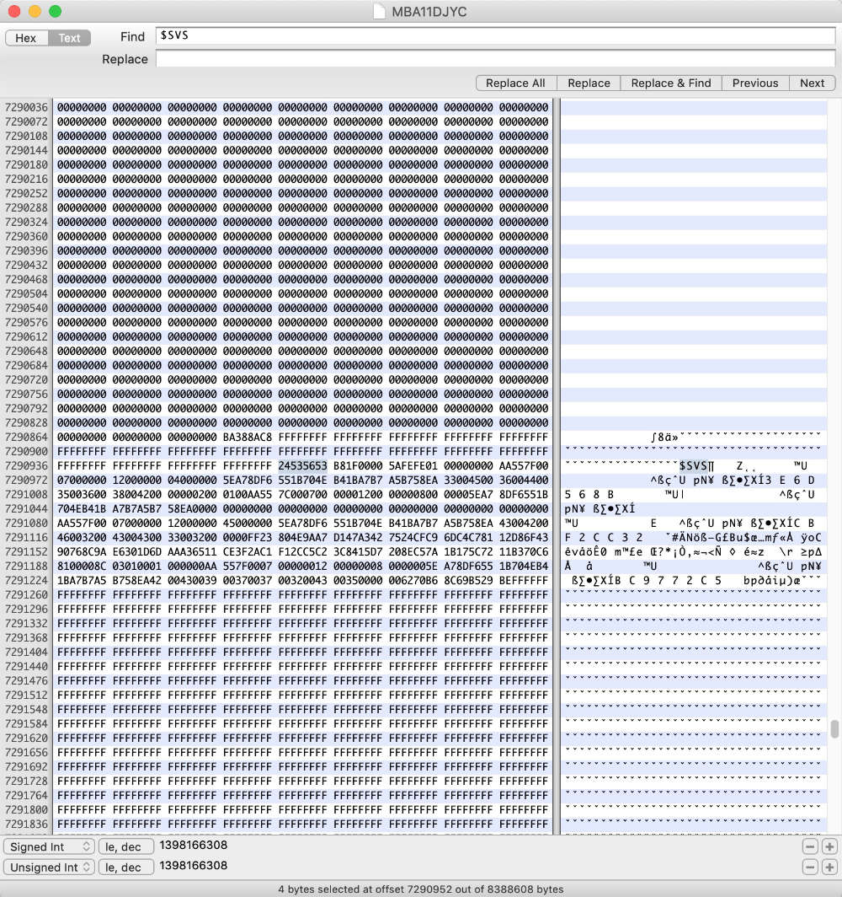

### Disclaimer:

Cet article et ces outils permettent des modifications profondes de l'ordinateur, incluant la possibilité de le rendre inutilisable. Nous ne saurions être tenus pour responsable d'une quelconque conséquences de l'utilisation des outils et conseils de cet article.

# L'EFI, c'est quoi ?

L'EFI, pour _**Extensible Firmware Interface**_ est un standard sous forme de  solution technique logicielle, basée sur un firmware, qui vise à remplacer l'ancien BIOS. Son rôle est donc de faire la traduction entre le matériel, et le logiciel (l'OS) pour permettre aux deux de fonctionner de concert. C'est le premier "logiciel" à se lancer, au démarrage, pour faire des vérifications matérielles et permettre à l'OS de se lancer par la suite. Il à été défini en premier par Intel, et aujourd'hui utilisé comme standard, sous le nom d'UEFI, sur quasiment tous les PC, quelque soit leur architecture et leur OS.

L'EFI, en théorie, ne peut pas être modifié par l'utilisateur, pour des raisons évidentes de sécurité, et d'intégrité de la machine. Malgré tout, y accéder et y faire des modifications, pour un technicien, permet des choses impossibles par ailleurs.

On peut ajouter des drivers, comme le drivers natif des disques NVMe sur les Macs plus anciens. Cela permet d'installer un SSD standard M2 NVMe dans un MacBook Pro ou MacBook Air d'avant 2015 (mais après 2012), tout en conservant toutes les fonctionnalités. Aujourd'hui, sans cette manipulation, votre MBPr de 2014 aura des problèmes de veille prolongée avec un SSD non-natif. En faisant cette modification de l'EFI, vous pourrez ajouter passe en veille profonde sans plantages.

On peut enlever le mot de passer EFI d'un Mac. L'utilisateur qui met en place ce mot de passe ne réalise pas toujours qu'il ne lui sera demandé que rarement (pour booter sur un disque externe par exemple) et qu'il devra donc s'en souvenir absolument. Modifier l'EFI permet de retirer ce mot de passe sur un Mac.

# Accéder à l'EFI et modifier le Firmware

## Le matériel nécessaire

On ne peut pas télécharger le firmware du Mac sans un peu de matériel. L'objectif ici, est de lire et écrire le firmware du Mac, en accédant directement à la puce EPROM soudée sur la carte mère. Il n'y a pas d'autre moyen de faire que celui-ci, étant donné que le Mac protège son firmware.

On à donc besoin:

- Programmeur Bus SPI
    - Un CH341a venu d'eBay fera l'affaire. Si vous avez mieux, c'est mieux
- Un pince SOIC8 ou un connecteur SPI adapté
    - Pour accéder à la puce sur un Mac non-retina, ou au port SPI/JTAG sur un retina
- Un logiciel de lecture/écriture de ROM
    - Nous utilisons flashrom, dans le Terminal de Mac OS
- Un ou des logiciel pour naviguer dans l'EFI
    - Hexfind pour naviguer dans l'EFI en Hexadécimal
    - UefiTool pour voir les différent "morceaux" de l'UEFI, et le copier/coller
- Un peu de temps...

## Lire l'EFI d'un Mac

Il faut se connecteur à la puce, en ouvrant le Mac d'abord. Si c'est un MacBook Pro non retina, vous avez accès à la puce grâce à une pince SOIC8. Si c'est un MacBook Air ou un Retina, il vous faut un connecteur spécifique pour vous brancher.

1. Ouvrir le Mac
2. Débrancher la batterie et le chargeur si ce n'est déjà fait
3. Brancher la pince ou le connecteur
4. Brancher le lecteur SPI à votre Mac
5. Lancer la commande de lecture de Flashrom:
    - flashrom -p _ch341a\_spi_ -r _nomdufichier_
        

Rappel de commande de Flashrom:

- \-p : Pour choisir le type de programmeur SPI
- \- r, -v,-w: Pour _read_, _verify_, ou _write_

Il faut faire plusieurs dump de votre EFI, c'est essentiel. Il faut également vérifier que votre dump est exact, en comparant la taille de chaque fichier, voir en comparant le checksum MD5. Il faut également comparer le dump et le contenu de l'EFI avec la commande suivant:

- - flashrom -p ch341a\_spi -v _nomduficher_

## Modifier le contenu de l'EFI

Pour enlever le mot de passe EFI, on utiliser Hexfind.

Il faut ouvrir le fichier dump de votre EFI, et rechercher la chaîne de caractères _$SVS_. Un fois trouvée, il faut remplacer ce qui se trouve entre les deux _$SVS_ (et pas effacer, mais bien remplacer, pour garder la même longueur de fichier). On vérifiera avant, et après, que le contenu se termine bien à la même ligne, c'est à dire, que le fichier à EXACTEMENT la même longeur.

A la fin, il suffit de récrire le fichier grâce à flashrom:

- - flashrom -p _ch341a\_spi_ -r _nomdufichier_
        

_**Attention:**_ Sur les macs plus récents, l'accès à la ROM de l'EFI est mieux protégée. Il faut, en fait, allumer le mac, puis l'éteindre, en restant appuyé sur le bouton _Power_. Ne pas enlever son doigt du bouton _Power_, et lancer le commandes que vous voulez (lecture, vérification, écriture). Gardez votre doigt sur _Power_ pendant toutes les manipulations...

L'autre chose possible est de re-flasher votre EFI. Et ce sera complété bientôt dans cet article... Soyez patient.
