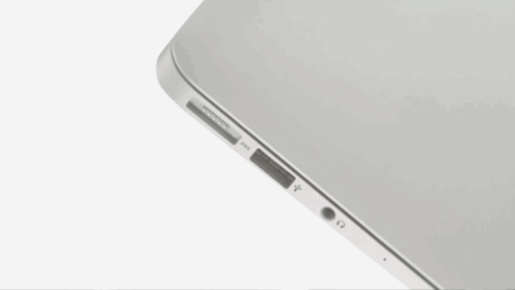

## Votre MacBook Pro ne charge plus. Quels diagnostics effectuer ?

## Les potentielles origines du problème de charge:

Il existe plusieurs origines possibles à un Mac qui ne charge plus. En voici quelques-unes des plus courantes:

- Problème de prise électrique
- Problème dans le câble du chargeur
- Problème matériel dans le chargeur
- Problème matériel de la carte-mère
- Surchauffe

## Diagnostiquer un Mac qui refuse de charger

### Étape 1 : La prise ou le chargeur

Il s'agit de vérifier tout ce qui concerne la prise ou le chargeur.

Vérifiez que la prise que vous utilisez est bien alimenté (ça paraît idiot... et pourtant). La multiprise est-elle bien allumée ? La prise délivre bien du courant ? Essayez avec une lampe ou le chargeur de votre téléphone par exemple. La solution est parfois aussi simple que ça pour un MacBook pro qui ne charge plus.

Observez le câble de votre chargeur. Il y a peut-être un coude ou un section un peu trop torsadée. Le fait de manipuler le câble de chargeur permet-il au Macbook Pro ou Air de charger par intermittence ?

Enfin, observer le connecteur de charge de votre Mac. Les MacBook Pro ou Air de 2008 à 2015 ont un connecteur Magsafe aimanté. Il arrive que des débris métalliques viennent s'y coller, et empêchent le Magsafe de charger votre Mac correctement. Sur les MacBook Pro Thunderbolt, ou leMacBook Air 2017, il s'agit de ports USB-C. Ceux-ci sont plus profonds, et des saletés ou corps étrangers ont pu s'y glisser, soit coté Macbook ou coté chargeur. Vérifier que qu'il sont bien libres et propres. Attention, n'insérer rien de métallique si votre Mac est allumé, ou votre chargeur branché ! Vous pourriez court-circuiter ce port et le rendre inutilisable. (Il faudrait alors faire appel à nous pour ce genre de réparation...).

Votre problème de Macbook Air ou MacBook Pro qui ne charge plus se trouve peut-être là, tout simplement...

### Étape 2 : Un problème matériel fait que le MacBook Pro ne charge plus

### Les chargeurs Mac sont "intelligents"... en quelque sorte

Le côté matériel du Mac peut également être impliqué. Le Magsafe contient un part d'électronique. C'est elle qui permet à la diode du connecteur de s'allumer vert ou orange selon le niveau de charge. Du côté des MacBook Pro USB-C, il y a également une négociation qui se fait entre le chargeur et le Mac. L'USB-C est en standard à 5 Volts. Une tension suffisante pour charge un téléphone mais bien insuffisante pour charger un Mac. Le chargeur et le Mac négocie alors pour être sûr que le chargeur peut transmettre 20 Volts en toute sécurité. Si cette entente ne se fait pas, le Mac refusera de charger.

#### Réinitialiser les systèmes de gestion de charge

La première chose à faire, sera, bien-sûr, de tenter de redémarrer votre Mac. Faites-le, idéalement, de façon propre, en cliquant sur le menu _Pomme_, puis sur _Redémarrer_.

Si votre MacBook Pro ne charge toujours pas après un redémarrage vous devrez tenter de réinitialiser le _SMC (System Management Control)_. Comme son nom l'indique, le _SMC_ est une puce de gestion de certaines fonctions matérielles du Mac. C'est son rôle de reconnaître le chargeur branché et de lui permettre ou non de charger le batterie. Il est chef d'orchestre de la charge, même si une autre puce est présente pour gérer la batterie. Il gère la mise-en-veille et le réveil, vérifie certains fonctions vitales avant le démarrage gère le niveau de rétroéclairage, parmi d'autres choses encore.

Vous l'avez compris, un plantage du SMC peut mener à un MacBook Pro qui refuse de charger.

Pour réinitialiser le SMC, il faut procéder de la façon suivant, selon que votre Mac possède une batterie amovible (pour les machines les plus anciennes) ou fixe pour les machines plus récentes:

- Sur un Mac avec batterie non-amovible (de 2009 à nos jours)
    1. Eteignez votre Mac
    2. Pressez les touches Maj + Control (_ctrl_) + Option (_alt_) du coté gauche de votre clavier et le bouton _Power_ (coté droit) pendant 10 secondes environ
    3. Relâcher ces touches. Vous devriez voir la lumière de votre chargeur Magsafe passer à l'orange puis revenir au vert.
    4. Appuyez sur le bouton _Power_ de votre Mac pour le rallumer.

- Sur un Mac avec une puce de sécurité T2 (MacBook Pro ou Air depuis 2018. Mac Mini depuis 2018, Mac Pro 2019 ou iMac Pro)
    1. Eteignez votre Mac
    2. Pressez les touches \[Control (_ctrl_)\] +  Option (_alt_)\] du coté gauche de votre clavier et les touches \[Maj + \[_Power\]_ du coté droit, pendant 10 secondes environ
    3. Relâcher ces touches. Vous devriez voir la lumière de votre chargeur Magsafe passer à l'orange puis revenir au vert.
    4. Appuyez sur le bouton _Power_ de votre Mac pour le rallumer.

- Sur un Mac avec batterie amovible (de 2009 ou avant)
    1. Eteignez votre Mac.
    2. Retirez la batterie.
    3. Pressez le bouton \[_Power_\] pendant 7 secondes environ.
    4. Remettez la batterie en place.
    5. Appuyez sur le bouton _Power_ de votre Mac pour le rallumer.

### Étape 3 : Le dernier recours

Il est possible que votre batterie ait surchauffé, ou soit trop froide et se mette en sécurité. Débranchez votre Mac et attendez qu'il revienne à température ambiante avant de tenter de le charger.

Si cela ne fonctionne pas non plus, vérifiez que la batterie est bien reconnue par votre Mac. Allez dans le menu _Pomme_ -> _A propos de ce Mac_ -> _Rapport Système_ -> _Alimentation._ Y-a-t'il bien des informations concernant votre batterie, comme son numéro de série ou son niveau de charge ? Si non, c'est que la batterie n'est pas reconnue par l'ordinateur. Cela peut venir de votre batterie ou de la carte mère. Un MacBook pro ne charge plus tant qu'il n'a pas reconnu la batterie et qu'il communique avec elle.

Il faut alors tenter de brancher une batterie neuve, ou de test, dont vous savez qu'elle fonctionne. Si la nouvelle batterie n'est toujours pas reconnue, vous faites face à un problème de carte mère. Dans ce cas, nous vous conseillons de nous contacter pour intervenir sur ce genre de problème. Nous pourrons vous guider pour remplacer une batterie, ou bien remplacement la puce de charge ou le SMC, ou les capteurs de charge (capteurs de courant) de votre carte mère.
