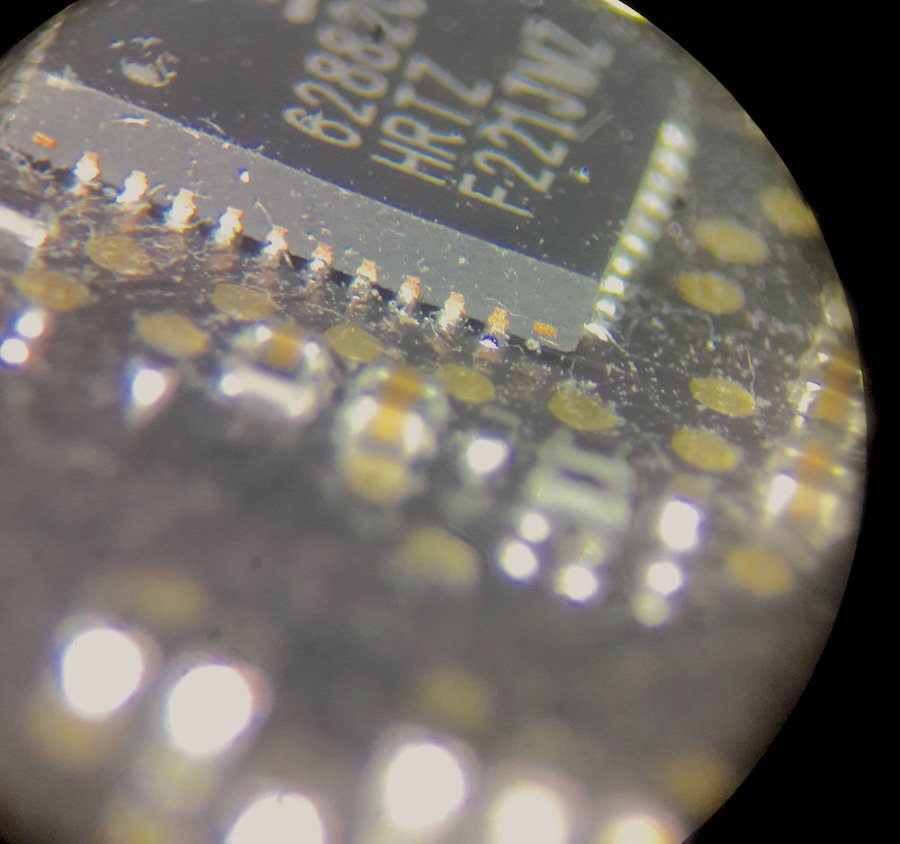

# Les problèmes de carte graphique et les MacBook Pro, une grande histoire d'amour

Les MacBook Pro 15 pouces ont cette particularité d'avoir une puce graphique peu puissante et intégrée au processeur Core i5/i7 d'Intel, et de proposer une seconde puce graphique, dédiée.

Les processeurs Intel et leur puce intégrée sont très fiables. On voit rarement la partie graphique de cette puce faillir. C'est d'ailleurs la raison pour laquelle cet article se concentre sur les MacBook Pro 15 pouces uniquement. De son coté, la puce graphique ajoutée sur la carte mère à connu de nombreuses failles, toutes différentes les unes des autres selon les générations. Mais ces soucis donnent, en général, des symptômes assez similaires. Tout cela n'est pas, ni pour aider au diagnostic, et encore moins pour aider à la réparation.

Alors comme on est sympas, on vous à concocté un petit guide. Les MacBook Pro et leur soucis de carte graphique, génération par génération. Cela inclus les symptômes, la cause du problèmes et les solutions possibles.

En route !

# MacBook Pro 15 pouces mi-2010

## Ce problème de GPU ne vient pas du GPU

Les MacBook pro 15 de mi-2010 sont dotés d'une carte mère numéro 820-2850. Ce sont des machines généralement fiables, et solides. Elles sont encore utilisables et utilisée aujourd'hui par de nombreuses personnes en bureautique ou pour de petites tâches quotidiennes. Leur problème graphique est encore trop souvent confondu avec celui des MacBook Pro 2011, mais nous y reviendrons.

### Un problème d'alimentation de la puce graphique

Sur ces Mac, le problème vient de l'instabilité de l'alimentation de la puce graphique. Si vous avez suivi notre article sur le rétroéclairage des Macs, vous ne serez pas perdus.

### Encore une histoire de condensateurs

La puce graphique à besoin d'une alimentation basse tension, qui varie selon la sollication du GPU. Il est alimenté à 1.35 ou 1.55 V lors de faibles charges, et doit être alimenté à 1.8 V lors de fortes charges. Il existe un circuit chargé de produire ces différentes tensions. Comme pour l'élévation de tension nécessaires au rétroéclairage de l'écran, on à ici un circuit en charge de l'abaissement de tension. Ce circuit fonctionne sur le même principe: une puce de commande, un transistor qui commute sur une inductance et des condensateurs de stabilisation. Je vous laisse réviser le rétroéclairage si vous ne suivez pas tout.

Ce sont les condensateurs qui posent problème, et en particulier le C9560. C'est un condensateur tantale-polymère qui vieilli mal et qui ne devrait pas être utilisé pour ce genre d'applications. La régulation de tension est donc mal faite lorsque la sollicitation du GPU est maximale, celui-ci plante.

Exemple des symptômes (parmi d'autres) d'un GPU défectueux sur MBP 15' 2011. Source: Macrumors forum

## Un condo, et ça repart !

La solution consiste donc à remplacer ce condensateur. Il est conseillé de le remplacer par un condensateur de technologie différente (comme un condensateur aluminium). Il sera plus gros et demandera donc un peu d'adaptation. Mais certains modèles on trois pad, ce qui poser ce composant plus facilement, même s'il est plus gros, sur les pads déjà présent sur la carte mère.

Notre modèle de prédilection ? Le EEF-LX0D331R4.

Et c'est vraiment magique. Une fois ce fameux  condensateur remplacé, la puce graphique du MacBook Pro 15 2010 passe tous les tests de stress GPU sans aucun problème.

# MacBook Pro 15 pouces 2011

## Le problème graphique le plus connu..

...et aussi celui qui à donné le plus de solutions farfelues (et de déçu qui l'ont tenté).

On va commencer d'entrée: non, passer votre carte mère au four ne solutionne pas le problème. Au mieux, vous avez ajouté un stress thermique à votre puce qui la fera fonctionner quelques semaines de plus.

Ce problème très connu à fait couler beaucoup d'encre, et fait beaucoup de tort à Apple, alors qu'ils n'étaient pas vraiment résponsables. Le GPU secondaire du MacBook Pro 2011 15 pouces était fabriqué par Nvidia (les Geforce GT330M). La défaillance vient bien de la puce elle-même, et pas de la soudure de cette puce. Le remplacement de la puce ne fera qu'allonger à nouveau la durée de vie, sur la base d'une nouvelle puce graphique qui contient le même défaut que l'ancienne.

Votre demande de réparation sur 6337.fr

Nous n'intervenons plus sur ces ordinateurs, et nous ne sommes pas les seuls réparateurs dans ce cas.

## Un problème interne au GPU

Le problème vient donc de vias: de minuscules ponts verticaux à l'intérieur de la puce qui permettent la communications entre les différents étages. Ce sont ces vias qui sont défectueux, et qui, avec le temps mais surtout avec les cycles thermique (passage du chaud au froid et inversement, de façon répétitive) fait d'abord craquer puis céder ces ponts.

En passant votre carte au four, vous permettez à ces vias de prendre un peu volume et donc potentiellement de se ressouder partiellement. Mais la cassure est toujours, et réapparaîtra avec le temps et l'usage. Le passage au four n'est donc que l'illusion d'un réparation pérenne.

Il en est de même pour le remplacement, le GPU étant touché par un vice de fabrication, voir de conception, le remplacement ne fait que remplacer une puce défectueuse par une puce qui sera bientôt défectueuse.

[MacBook Pro 2011 problème carte graphique GPU](images/2011-GPU-screen-2.jpg  Exemple des symptômes d'un GPU défectueux sur MBP 15 mi-2011. Source: Macrumors forum\[/caption\]

## Désactiver le GPU, la seule solution fiable

La seule solution fiable que nous proposons est donc de désactiver le GPU secondaire. Cela dire aussi dégrader les performances de votre ordinateur: Vous ne pourrez plus lancer de jeu 3D dans de bonnes conditions, les performances graphiques seront dégradées, la sorti vidéo deviendra inactive et le rétroéclairage de l'écran ne sera plus réglable.

C'est le prix à payer pour retrouver une machine fonctionnelle.

# MacBook Pro 15 pouces Retina 2012

## La série des GPU défectueux ne s'arrête pas en 2011...

La partie accélération graphique des MacBook Pro 15 pouces Retina 2012 comporte elle aussi un défaut. Celui ci n'a jamais été avoué par Apple, et encore moins pris en garantie étendue.

Les symptômes ici sont parfois divergents, mais le plus souvent, votre Mac affiche un écran noir, soit directement après avoir booté, ou bien en sollicitant la carte graphique. L'écran devient noir mais le MacBook Pro fonctionne toujours. Vous entendez le bruit des touches ou du réglages du son. La seule manière de sortir de ce plantage et de redémarrer la machine d'autres fois le Mac redémarre de lui-même.

Là aussi, ce n'est pas le GPU qui est en cause, mais une histoire de soudures sur de puces d'alimentation du GPU.

## La faute à des soudures un peu légères

Cette série de MacBook Pro, les Retina 2012 15 pouces, a connu un défaut de fabrication. Trop peu de pâte à braser à été appliquée pour certains soudures. Résultat, les soudures sont trop fines, elles craquèlent ou se défont avec le temps.  Ce sont plus spécifiquement les soudures de la puce de gestion d'alimentation (encore elle). Notre photo prise au microscope montre bien la légèreté des soudures autour de ce composant.

Peu de réparateurs sont au fait de ce problème alors que la solution n'est pas si compliquée : il faut reprendre ces soudures à l'étain, avec un fer adapté. Une fois les soudures refaites, plus aucun problème.

# Et ensuite...

Eh bien, ensuite, on continue de travailler, avec la communauté de réparateurs de cartes-mères, à trouver les sources des problèmes et les solutions associées. D'autres problèmes de production sur les Macs sont apparus sur les séries suivantes, pas forcément sur des carte graphique, mais ailleurs (écran, clavier, SSD par exemple). Tous ces problèmes, nous les connaissons, les documentons, nous partageons avec d'autres réparateurs pour tous avancer vers une solution.
